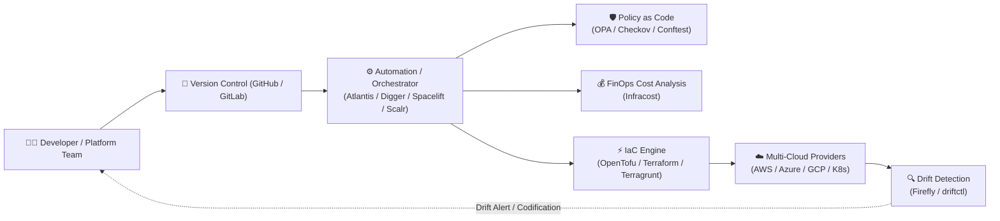

  

       

---

# 🚀 Awesome Terraform &amp; OpenTofu Automation Platforms (TACOs)

> 🌐 **Curated List of SaaS Platforms & Open-Source Tools for Infrastructure as Code (IaC) Orchestration, PR Automation, Policy-as-Code, Remote State, Drift Detection, and GitOps Workflows.**

**Last updated: August 2026** 📅

This directory tracks the leading **SaaS platforms** and **open-source repositories** for **Terraform Automation &amp; OpenTofu Management** (often termed **TACOs** – *Terraform Automation and Collaboration Software*). These solutions orchestrate multi-cloud deployments, automate pull-request workflows, enforce compliance policies, manage remote states, provide continuous drift detection, and empower platform engineering teams.

---

## 📑 Table of Contents

- [☁️ SaaS / Hosted Platforms](#️-saas--hosted-platforms)
- [🛠️ Open-Source GitHub Projects](#️-open-source-github-projects)
- [🧩 Key Architecture &amp; Ecosystem Components](#-key-architecture--ecosystem-components)
- [🤝 How to Contribute](#-how-to-contribute)
- [📈 Star History](#-star-history)
- [📜 Disclaimer &amp; License](#-disclaimer--license)

---

## ☁️ SaaS / Hosted Platforms

Below is a breakdown of prominent commercial and managed Terraform / OpenTofu automation platforms, sorted in descending order by company scale (valuation, revenue, or venture funding).

| Platform | Company Size / Scale | Description | Starting Pricing | Free Tier Limits |
| :--- | :--- | :--- | :--- | :--- |
| **[Terraform Cloud / HCP Terraform](https://www.hashicorp.com/products/terraform)** | 🏢 **~$6.4B Valuation** (IBM Acquisition; $583M+ Annual Revenue) | HashiCorp’s official managed platform for remote state, run orchestration, private registries, and team collaboration around Terraform. | Starts at **$0.10 / managed resource / month** (Essentials tier; Standard tier at $0.47 / resource / month) | **Free forever** for up to 500 managed resources, 1 concurrent run, unlimited users, and 1 policy set (up to 5 policies); includes $500 HCP trial credits for paid tiers. |
| **[Spacelift](https://spacelift.io/)** | 🚀 **~$100M+ Est. Valuation** ($73.6M Total Funding; Series C) | Multi-IaC orchestration platform supporting Terraform, OpenTofu, Terragrunt, Pulumi, CloudFormation, Kubernetes, and Ansible with strong policy-as-code and stack dependencies. | Starts at **$20,000 / year** (Starter+ tier billed annually) | **Free forever** for up to 2 users and 1 public worker (1 concurrent run); 14-day free trial on paid features. |
| **[env0 (env zero)](https://www.env0.com/)** | 💼 **~$42M Total Funding** (Series B, Backed by PayPal Ventures &amp; M12) | Multi-IaC management platform with FinOps visibility, supporting Terraform, OpenTofu, Terragrunt, Pulumi, and custom workflows. | Starts at **$1,500 / month** (Cloud Compass tier) | **Free forever** for up to 250 runs/month and 30 active environments; 14-day free trial available for advanced features. |
| **[Firefly](https://www.firefly.ai/)** | 🦄 **$30M Total Funding** (Series A, Backed by SoftBank &amp; Vertex) | Cloud asset management and IaC platform that helps discover unmanaged assets, codify them, and remediate drift across multi-cloud environments. | Starts at **$2,499 / month** (Essential tier via AWS Marketplace, billed annually) | **Free forever** for up to 500 managed cloud resources / assets; 14-day free trial available for paid tiers. |
| **[OpsLevel](https://www.opslevel.com/)** | 📊 **$22.2M Total Funding** (Series A, Backed by Bessemer Venture Partners) | Internal Developer Portal (IDP) and service catalog platform that integrates with Terraform workflows for service maturity, ownership, and GitOps tracking. | Starts at **$10,000 / year** (~$833 / month for up to 20 users / ~$25–$45 / developer / month) | **14 to 30-day free trial** / POC with full catalog and check integration access (no permanent free tier). |
| **[Scalr](https://scalr.com/)** | 💡 **~$15.8M Est. Valuation** ($7.35M Total Funding) | Pure-play Terraform/OpenTofu TACO focused on hierarchical governance, OPA policies, remote operations, and predictable per-run pricing. | Starts at **$0.99 / run** (or **$99 / month** for 100 prepaid runs package) | **Free forever** for up to 50 runs/month, 5 concurrent runs, unlimited users, workspaces, and resources under management. |
| **[Massdriver](https://www.massdriver.cloud/)** | ⚡ **$12.5M Total Funding** (Y Combinator Alum, Seed/Series A) | Platform engineering and infrastructure orchestration tool with visual Terraform modules and developer self-service automation. | Starts at **$999 / month for 15 seats** (Business tier billed annually) | **14 to 30-day free trial** with full platform and POC access (no permanent free tier). |
| **[Digger](https://digger.dev/)** | 🔧 **$6.6M Total Funding** ($3.6M Seed Round) | IaC orchestration engine that runs Terraform/OpenTofu natively inside your existing CI (GitHub Actions, GitLab CI, etc.). | Starts at **$49 / user / month** (Digger Pro / OpenTaco, min. 5 seats; Enterprise from $3,000 / month) | **Free forever Community Edition** (100% open-source, runs in your CI with unlimited runs/resources); 14-day free trial for Pro. |
| **[Brainboard](https://www.brainboard.co/)** | 🎨 **$1.55M Total Funding** (~$2.5M–$5M Est. Valuation) | Visual infrastructure-as-code design and automation platform that automatically generates, validates, and deploys Terraform architectures. | Starts at **$99 / user / month** (Pro plan) | **Free forever** for individual use (unlimited cloud architectures and Terraform code generation); 21-day free trial for Pro features. |
| **[Atlantis](https://www.runatlantis.io/)** | 🌐 **Open-Source Community** (Linux Foundation / CNCF Ecosystem) | Self-hosted Terraform pull-request automation engine that teams run on Kubernetes/VMs as a managed service pattern. | **Free** (Open-Source / Self-Hosted) | **Free forever** (100% open-source under Apache 2.0; unlimited users, runs, and resources; self-hosted compute costs apply). |

---

## 🛠️ Open-Source GitHub Projects

Curated open-source projects for Terraform &amp; OpenTofu automation, drift management, testing, and policy enforcement, **ranked descending by GitHub Star Count** ⭐:

1. **[OpenTofu](https://github.com/opentofu/opentofu)**   
   ⚡ OpenTofu is a community-driven, open-source fork of Terraform managed under the Linux Foundation. Drop-in compatible with Terraform configurations, providers, and state files.

2. **[Infracost](https://github.com/infracost/infracost)**   
   💰 Cloud cost estimates for Terraform, OpenTofu, and Terragrunt in pull requests. Helps engineering teams prevent cloud cost surprises before merging changes.

3. **[OPA (Open Policy Agent)](https://github.com/open-policy-agent/opa)**   
   🛡️ General-purpose policy engine providing policy-as-code enforcement across the entire cloud-native stack, widely used in Terraform plan inspection and compliance gates.

4. **[Atlantis](https://github.com/runatlantis/atlantis)**   
   🤖 The foundational open-source Terraform Pull Request Automation tool. Listens for VCS webhooks, runs `terraform plan` and `apply` via PR comments, and manages plan locks.

5. **[Terragrunt](https://github.com/gruntwork-io/terragrunt)**   
   📦 Thin orchestration wrapper that provides extra tools for keeping Terraform configurations DRY, managing remote state, and orchestrating multi-module dependencies.

6. **[Checkov](https://github.com/bridgecrewio/checkov)**   
   🔒 Static analysis security scanner for Infrastructure as Code (Terraform, CloudFormation, Kubernetes, ARM, Bicep, Helm) with built-in compliance frameworks.

7. **[tfsec](https://github.com/aquasecurity/tfsec)**   
   🔍 Fast, developer-friendly security scanner for Terraform code that checks for security misconfigurations and best practices before provisioning.

8. **[TFLint](https://github.com/terraform-linters/tflint)**   
   🧹 Pluggable Terraform linter that verifies provider-specific best practices, invalid instance types, syntax errors, and deprecated configurations.

9. **[Terrascan](https://github.com/tenable/terrascan)**   
   🛡️ Static code analyzer powered by Open Policy Agent (OPA) to detect security compliance vulnerabilities across multi-cloud Terraform files.

10. **[Digger (OpenTaco)](https://github.com/diggerhq/digger)**   
    ⚙️ CI-native IaC orchestrator that runs Terraform/OpenTofu directly inside your existing CI pipelines (GitHub Actions, GitLab CI) without third-party runner lock-in.

11. **[pre-commit-terraform](https://github.com/antonbabenko/pre-commit-terraform)**   
    🪝 Collection of git pre-commit hooks for Terraform formatting, documentation generation (terraform-docs), linting (tflint), and security scanning.

12. **[Terramate](https://github.com/terramate-io/terramate)**   
    📐 IaC orchestration tool designed to manage multi-stack Terraform &amp; OpenTofu architectures with change detection, code generation, and parallel execution.

13. **[Conftest](https://github.com/open-policy-agent/conftest)**   
    🧪 Utility for testing structured configuration data against Rego policies, widely applied to validate `terraform.tfplan.json` outputs in CI pipelines.

14. **[driftctl](https://github.com/snyk/driftctl)**   
    🔍 CLI tool that tracks, measures, and alerts on infrastructure drift between real-world cloud assets and Terraform state files.

15. **[Rover](https://github.com/im2nguyen/rover)**   
    🧭 Interactive visualizer for Terraform state and configuration files that parses plans and builds interactive dependency graphs.

16. **[Blast Radius](https://github.com/200ok-solutions/blast-radius)**   
    💥 Interactive visualization tool that renders live dependency graphs and resource relationships from Terraform files.

17. **[Tofu-Controller / Flux TF-Controller](https://github.com/flux-iac/tofu-controller)**   
    ☸️ GitOps controller for Kubernetes that reconciles Terraform &amp; OpenTofu resources continuously using the Flux GitOps toolkit.

18. **[Terrateam](https://github.com/terrateamio/terrateam)**   
    🐙 Git-centric Terraform/OpenTofu/Terragrunt pull-request automation system supporting strict branch workflows and custom orchestration hooks.

19. **[terraform-aws-atlantis](https://github.com/terraform-aws-modules/terraform-aws-atlantis)**   
    🏗️ Battle-tested Terraform module to deploy production Atlantis instances on AWS (ECS, Fargate, ALB, Route53, and IAM).

20. **[Regula](https://github.com/fugue/regula)**   
    📋 Policy engine that checks Terraform, CloudFormation, and Kubernetes manifests for security and compliance rules against CIS Benchmarks.

---

## 🧩 Key Architecture &amp; Ecosystem Components

---

## 🤝 How to Contribute

1. 🍴 **Fork** this repository.
2. 🌿 **Create a feature branch**: `git checkout -b add-iac-tool`.
3. 📝 **Add or update entries** in `README.md` keeping the tabular/ranked formats and exact links.
4. 🚀 **Submit a Pull Request** with a brief summary of the added platform or open-source tool.

⭐ **Star this repository** if you find this ecosystem directory valuable for your DevOps and cloud engineering journeys!

---

## 📈 Star History

---

## 📜 Disclaimer &amp; License

- 🛡️ **Community Curated**: This list is independently maintained by the cloud community. Product names, logos, and trademarks belong to their respective owners.
- ⚠️ **Operational Safety**: Terraform automation tools execute infrastructure mutations that directly impact live cloud environments and costs. Ensure least-privilege IAM policies, automated testing, and state locking are enforced.
- 📄 Distributed under the **MIT License**.
